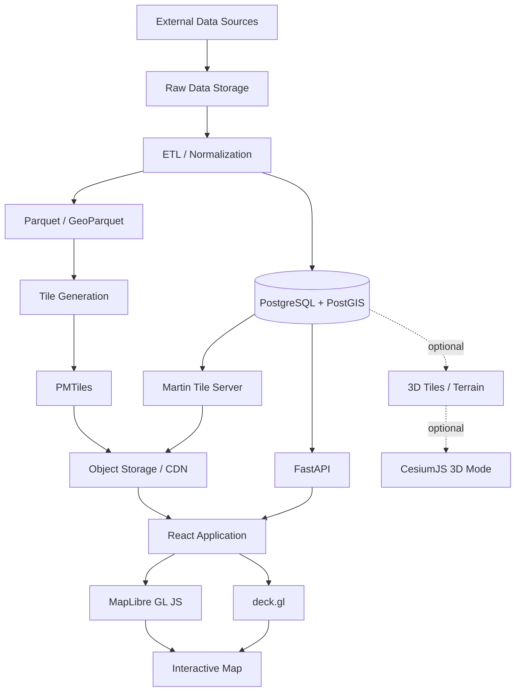

# Russia Resource & Infrastructure Map

Interactive geospatial platform for exploring the resource, industrial, transport, and economic infrastructure of the Russian Federation.

The project is designed as a **data-rich geospatial application**, not as a conventional marker-based web map.

Its purpose is to combine:

- natural resource extraction sites;
- industrial and processing facilities;
- railways;
- highways and major roads;
- airports;
- seaports and river ports;
- navigable waterways;
- pipelines where reliable public data is available;
- logistics and economic flows;
- regional statistics;
- historical and time-series data;

into a single high-performance interactive interface.

The application should support both **analytical exploration** and **rich-media storytelling**.

---

# 1. Product Vision

The application should make it possible to understand not only **where things are located**, but also **how resources, industry, transport, and logistics are connected**.

The map should answer questions such as:

- Where are major oil, gas, coal, metal, and mineral deposits located?
- Which industrial facilities process these resources?
- How are extraction sites connected to factories, ports, and consumers?
- Which railway and road corridors support particular industrial regions?
- How does production vary geographically?
- How has production changed over time?
- Which regions form major industrial clusters?
- How are export and domestic logistics routes structured?
- What does the economic geography of a region look like?

The long-term goal is to create a visual model of the country's economic and transport geography.

---

# 2. Core Design Principles

## 2.1 Data first

The visual experience must never come at the expense of data quality.

Every important quantitative value should have:

- source;
- source URL or source identifier;
- reference year;
- unit;
- retrieval date;
- confidence / quality metadata where appropriate.

Unknown values must remain unknown rather than being silently estimated.

---

## 2.2 Progressive disclosure

The application must not attempt to show everything at once.

Information should progressively appear based on:

- zoom level;
- selected domain;
- active filters;
- selected object;
- current storytelling mode.

Example:

```text
country
  ↓
economic regions
  ↓
major industrial clusters
  ↓
facilities
  ↓
individual infrastructure elements
```

---

## 2.3 Vector-first rendering

Large geographic datasets must not be sent to the browser as monolithic GeoJSON files.

Preferred delivery formats:

- MVT;
- PMTiles;
- 3D Tiles where appropriate;
- small GeoJSON payloads only for genuinely small dynamic datasets.

---

## 2.4 2D first, 3D when useful

3D is an analytical and storytelling tool, not a default decoration.

Most interaction happens in a high-performance 2D / 2.5D map.

3D should be used for:

- terrain;
- volumetric indicators;
- industrial clusters;
- resource production columns;
- flow arcs;
- cinematic camera transitions;
- selected detailed locations;
- globe-scale visualization.

---

## 2.5 Self-hostable architecture

The core application must not require a proprietary map vendor.

The project should remain capable of running using:

- self-hosted tiles;
- self-hosted PostGIS;
- self-hosted APIs;
- open-source map engines.

External commercial providers may be integrated later as optional services.

---

## 2.6 Reproducible data pipeline

Raw source data must be transformable into production datasets through documented and reproducible pipelines.

Manual editing of production geodata should be minimized.

Pipeline stages should broadly follow:

```text
source
  ↓
raw data
  ↓
normalization
  ↓
validation
  ↓
geospatial enrichment
  ↓
canonical datasets
  ↓
tiles / database
  ↓
application
```

---

# 3. High-Level Architecture



---

# 4. Technology Stack

## Frontend

Primary technologies:

```text
React
TypeScript
Vite
MapLibre GL JS
deck.gl
Zustand
TanStack Query
Framer Motion
Tailwind CSS
```

Optional:

```text
GSAP
CesiumJS
ECharts
D3
```

Responsibilities:

### MapLibre GL JS

Primary map engine.

Responsible for:

- basemap;
- vector tiles;
- labels;
- roads;
- railways;
- administrative geometry;
- terrain;
- camera;
- globe projection;
- map interaction.

### deck.gl

High-volume analytical visualization layer.

Responsible for:

- resource points;
- large point datasets;
- aggregation;
- heatmaps;
- hexagonal layers;
- flow visualization;
- arcs;
- animated paths;
- TripsLayer;
- GPU filtering;
- 3D columns;
- custom analytical layers.

### CesiumJS

Optional dedicated advanced 3D mode.

Cesium is **not** the default rendering engine.

Use Cesium when the application requires:

- true 3D globe visualization;
- detailed terrain;
- 3D Tiles;
- detailed industrial models;
- large 3D scenes;
- vertical subsurface or above-ground structures.

Cesium-specific features should be isolated so that the main application remains functional without Cesium.

---

# 5. Backend

Primary backend:

```text
Python
FastAPI
PostgreSQL
PostGIS
Martin
```

The backend is divided conceptually into two systems.

## Tile delivery

```text
PostGIS
   ↓
Martin
   ↓
MVT
   ↓
CDN
   ↓
MapLibre
```

Used for dynamic geospatial layers.

## Application API

```text
React
  ↓
FastAPI
  ↓
PostGIS
```

Used for structured domain data.

Example endpoints may include:

```text
GET /api/resources/:id
GET /api/facilities/:id
GET /api/regions/:id
GET /api/search
GET /api/timeseries
GET /api/related
GET /api/flows
```

The application API should not be used for delivering millions of raw geographic features.

---

# 6. Geospatial Storage

Primary spatial database:

```text
PostgreSQL + PostGIS
```

PostGIS stores canonical objects that require:

- querying;
- filtering;
- spatial joins;
- relationships;
- dynamic tiles;
- temporal data;
- metadata.

Large immutable or rarely changing layers should preferably be distributed as:

```text
PMTiles
```

Typical PMTiles layers:

```text
basemap.pmtiles
railways.pmtiles
roads.pmtiles
waterways.pmtiles
administrative.pmtiles
```

Datasets under active development may remain in PostGIS until stabilized.

---

# 7. Data Engineering

Preferred processing stack:

```text
Python
DuckDB
DuckDB Spatial
Polars
GeoPandas
GDAL
ogr2ogr
```

Preferred intermediate formats:

```text
Parquet
GeoParquet
```

Avoid using CSV or GeoJSON as canonical storage formats.

They may still be used for data ingestion or export.

---

# 8. Tile Generation

Tools may include:

```text
Tippecanoe
Planetiler
Martin
```

Suggested responsibilities:

### Planetiler

Primarily for creating basemap-style vector tiles from OpenStreetMap or similarly large geographic datasets.

### Tippecanoe

Primarily for creating custom vector tile datasets from normalized project data.

### Martin

Runtime serving of:

- PostGIS vector tiles;
- PMTiles;
- MBTiles;
- other supported spatial sources.

---

# 9. Main Data Domains

The system should treat different geographic objects as domain entities rather than generic map markers.

Initial domains:

```text
resources
industry
railways
roads
airports
ports
waterways
pipelines
regions
companies
flows
statistics
```

---

# 10. Resource Model

Example conceptual resource entity:

```text
ResourceSite

id
name
resource_type
resource_subtype
status

operator_id
region_id

latitude
longitude
geometry

annual_production
production_unit
production_year

estimated_reserves
reserve_unit

discovery_year
commissioned_year

source_id
source_date
data_quality
```

Resource categories may include:

```text
oil
natural gas
coal
iron ore
copper
nickel
gold
silver
diamonds
uranium
bauxite
phosphates
potash
rare earth elements
other minerals
```

The taxonomy must be extensible rather than hard-coded into UI components.

---

# 11. Industrial Facility Model

Example facility types:

```text
oil refinery
gas processing plant
petrochemical plant
steel mill
aluminium plant
mining and processing plant
coal preparation plant
power plant
chemical plant
fertilizer plant
cement plant
timber processing plant
industrial port terminal
```

Conceptual model:

```text
IndustrialFacility

id
name
facility_type
status

operator_id
region_id

geometry

capacity
capacity_unit
capacity_year

commissioned_year

source_id
source_date
```

---

# 12. Transport Infrastructure

Transport is a first-class domain.

Supported categories:

```text
railways
roads
airports
seaports
river ports
navigable rivers
canals
pipelines
logistics terminals
```

Transport features may contain attributes such as:

```text
status
capacity
traffic
electrification
track count
road class
surface
lanes
cargo volume
passenger volume
operator
year
```

---

# 13. Economic Graph

A major long-term feature is to represent the economy as a spatial graph.

Example:

```text
resource site
     ↓
railway / pipeline
     ↓
processing facility
     ↓
transport corridor
     ↓
port
     ↓
destination
```

Graph edges may represent:

```text
physical transport connection
supply relationship
ownership
processing relationship
cargo flow
energy flow
```

This creates a second model on top of geographic coordinates:

```text
geospatial model
+
economic network graph
```

A selected facility should eventually be able to reveal its connected economic network.

---

# 14. Map Layers

Example logical layer hierarchy:

```text
BASE
├── land
├── water
├── boundaries
├── cities
└── labels

RESOURCES
├── oil
├── gas
├── coal
├── metals
└── minerals

INDUSTRY
├── refining
├── metallurgy
├── chemicals
├── energy
└── processing

TRANSPORT
├── railway
├── roads
├── airports
├── seaports
├── waterways
└── pipelines

ANALYTICS
├── heatmap
├── production
├── density
├── flows
└── clusters
```

The UI layer tree and renderer implementation should remain separate.

---

# 15. Zoom Strategy

The map must use semantic zooming.

Example:

```text
zoom 2–4
country-level patterns
major cities
major resource basins
major transport corridors

zoom 5–7
regional infrastructure
large industrial facilities
major deposits
main railway network

zoom 8–11
individual facilities
secondary railways
major roads
ports
industrial areas

zoom 12+
detailed infrastructure
local networks
facility geometry
```

Individual layers should define explicit:

```text
minZoom
maxZoom
```

Rendering everything at every zoom level is prohibited.

---

# 16. Rich-Media Visualization

The project should support several visualization modes.

## Standard map

Traditional analytical map.

Best for:

- navigation;
- filters;
- object exploration;
- comparison.

## Production landscape

Vertical columns represent quantitative values.

Examples:

```text
height = annual production
height = industrial capacity
height = port throughput
```

## Flow mode

Visualize connections between locations.

Possible techniques:

```text
ArcLayer
PathLayer
TripsLayer
animated particles
line width by volume
line opacity by importance
```

## Density mode

Possible techniques:

```text
HeatmapLayer
HexagonLayer
GridLayer
```

## Globe mode

Used primarily for:

- national overview;
- export routes;
- international logistics;
- storytelling.

## Story mode

A controlled sequence may combine:

```text
camera movement
layer transitions
text narration
charts
object selection
time changes
```

Story mode should use the same data model as the analytical interface.

It must not become a separate hard-coded application.

---

# 17. 3D Strategy

3D should remain purposeful.

Recommended uses:

### Terrain

Useful for:

- mountain regions;
- mining;
- hydro infrastructure;
- railway corridors;
- passes.

### Extrusions

Useful for:

- production;
- industrial capacity;
- economic density;
- port throughput.

### 3D models

Only for selected important locations.

Do not create thousands of detailed decorative factory models.

### 3D Tiles

Use when large-scale detailed 3D content becomes a real requirement.

Do not introduce 3D Tiles prematurely.

---

# 18. Time

The data model should support temporal information from the beginning.

Features may contain:

```text
valid_from
valid_to
reference_year
```

Quantitative observations should preferably be stored separately.

Example:

```text
ProductionObservation

entity_id
year
value
unit
source_id
```

This enables future features such as:

```text
timeline slider
historical map
production changes
infrastructure openings
facility closures
time-based flows
```

---

# 19. Data Provenance

Every important dataset should have source metadata.

Conceptual source object:

```text
DataSource

id
name
publisher
url
license

retrieved_at
published_at

description
notes
```

Individual records should reference their source.

Where multiple sources disagree, data conflicts should be preserved rather than silently overwritten.

---

# 20. Public Data Scope

The project is intended to visualize publicly available civilian, economic, industrial, and transport information.

Restricted, classified, military, or intentionally non-public infrastructure is outside the project scope.

The ingestion pipeline should preserve source licensing and attribution requirements.

---

# 21. Search

The application should eventually support unified search across:

```text
regions
cities
resource sites
industrial facilities
airports
ports
companies
transport objects
```

Search should resolve domain entities, not arbitrary map coordinates only.

Example:

```text
"Норильск"
"Ванкор"
"Транссиб"
"Мурманский порт"
"Газпром"
```

---

# 22. Object Inspector

Clicking a map object should open an inspector.

Example structure:

```text
Name

Category
Status
Operator
Region

Key metrics

Production / capacity
Historical chart

Connections

Related:
- transport
- resources
- factories
- ports

Sources
```

The inspector should be URL-addressable where possible.

Example:

```text
/map/resource/vankor
/map/facility/example-refinery
```

This enables deep linking and sharing.

---

# 23. State Management

Recommended division:

```text
Zustand
```

for local application state:

```text
active layers
filters
selected entity
visualization mode
map UI state
timeline
```

and:

```text
TanStack Query
```

for server state:

```text
API requests
entity metadata
statistics
search
time series
```

Do not duplicate remote API data inside Zustand unless there is a strong architectural reason.

---

# 24. Performance Rules

Performance is a core product requirement.

The following patterns should be avoided:

```text
huge GeoJSON downloads
rendering every object at every zoom
thousands of React DOM map markers
unbounded API responses
duplicating geometry in multiple client stores
large synchronous computations on the UI thread
```

Preferred solutions:

```text
MVT
PMTiles
GPU rendering
server-side spatial filtering
tile-based loading
LOD
clustering
Web Workers where appropriate
CDN caching
```

Target:

The interface should remain smooth while navigating national-scale datasets.

---

# 25. UI Architecture

Map rendering and application UI must be separate systems.

Conceptually:

```text
AppShell
├── Header
├── Sidebar
├── MapViewport
├── LayerPanel
├── FilterPanel
├── EntityInspector
├── Timeline
├── Search
└── StoryOverlay
```

Map-specific logic should live outside presentation components.

Avoid directly embedding complex MapLibre API calls inside arbitrary React UI components.

---

# 26. Visual Language

The interface should feel closer to:

```text
data journalism
geospatial intelligence
economic atlas
modern analytical dashboard
```

than to a conventional consumer navigation map.

Desired qualities:

```text
minimal
high information density
smooth
cinematic when appropriate
clear typography
controlled use of color
strong hierarchy
```

The map itself is the primary visual surface.

UI chrome should remain secondary.

---

# 27. Responsive Design

Desktop is the initial primary platform.

Initial priorities:

```text
1440px desktop
1920px desktop
large external displays
```

Tablet support should follow.

Mobile may provide a reduced exploration experience rather than attempting full feature parity immediately.

---

# 28. Accessibility

Important UI functions should not depend exclusively on map interaction.

Where practical:

- keyboard navigation;
- accessible controls;
- semantic HTML;
- sufficient contrast;
- screen-reader labels;
- reduced-motion mode.

Animations must respect:

```css
prefers-reduced-motion
```

---

# 29. Repository Structure

Initial monorepo structure:

```text
/
├── apps/
│   ├── web/
│   └── api/
│
├── packages/
│   ├── ui/
│   ├── map/
│   ├── domain/
│   ├── config/
│   └── types/
│
├── data/
│   ├── schemas/
│   ├── fixtures/
│   └── README.md
│
├── pipelines/
│   ├── ingestion/
│   ├── transforms/
│   ├── validation/
│   └── tiles/
│
├── infra/
│   ├── docker/
│   ├── database/
│   └── deployment/
│
├── docs/
│   ├── architecture/
│   ├── adr/
│   ├── data/
│   └── design/
│
├── scripts/
│
├── README.md
└── LICENSE
```

Exact structure may evolve as real implementation requirements emerge.

---

# 30. Architecture Decision Records

Significant architectural changes should be documented in:

```text
/docs/adr/
```

Example:

```text
0001-maplibre-as-primary-map-engine.md
0002-postgis-as-spatial-database.md
0003-pmtiles-for-static-layers.md
0004-cesium-as-optional-3d-engine.md
```

An architectural decision should not be silently replaced by a new library during implementation.

---

# 31. Testing Strategy

Testing should exist at several levels.

## Unit tests

For:

```text
domain transforms
formatters
filter logic
geometry utilities
data normalization
```

## API tests

For:

```text
search
entity retrieval
statistics
filters
validation
```

## Data tests

For:

```text
schema validation
coordinate ranges
duplicate IDs
invalid geometries
missing provenance
unit consistency
```

## End-to-end tests

For critical user flows:

```text
load map
enable layer
search entity
select entity
change filter
open inspector
change time
```

Visual regression testing may later be added for key map states.

---

# 32. Observability

Production deployments should eventually include:

```text
application logs
API metrics
database metrics
tile request metrics
frontend error reporting
performance monitoring
```

Tile latency and map rendering performance should be observable.

---

# 33. Development Environment

Local development should eventually be runnable through a small number of commands.

Desired experience:

```bash
docker compose up -d

pnpm install
pnpm dev
```

and separately for data tooling:

```bash
uv sync
```

Exact tooling will be established during repository bootstrap.

## Phase 1 local development

Requirements: Docker Compose, Node.js 24, pnpm, Python 3.12+, and uv. The five map points are synthetic test fixtures, not real sites.

```powershell
Copy-Item .env.example .env # first run only; keep your local settings on later runs
docker compose up -d --wait postgres
Set-Location apps/api
uv sync --locked --group dev
uv run --env-file ../../.env alembic upgrade head
Set-Location ../..
docker compose up -d --wait martin
pnpm install
pnpm dev
```

In a second terminal, start the API:

```powershell
Set-Location apps/api
uv sync
uv run --env-file ../../.env uvicorn app.main:app --reload --host 127.0.0.1 --port 8000
```

Open `http://127.0.0.1:5173`. The development overlay shows tile, API, and database status. Vite proxies `/tiles` to Martin and `/api` to FastAPI; their targets are set by `MARTIN_PROXY_TARGET` and `API_PROXY_TARGET` in `.env`. `VITE_TILE_URL` and `VITE_API_URL` set the browser paths. For a deployed static build, route those paths to Martin and FastAPI or set the Vite variables to suitable public URLs at build time.

Validate the running services from the repository root:

```powershell
Invoke-RestMethod http://127.0.0.1:8000/health
Invoke-RestMethod http://127.0.0.1:8000/health/db
Invoke-RestMethod http://127.0.0.1:3000/demo_sites
Invoke-WebRequest http://127.0.0.1:3000/demo_sites/0/0/0 | Select-Object StatusCode, RawContentLength
docker compose exec postgres psql -U russia_map -d russia_map -c "SELECT PostGIS_Version(), count(*) FROM demo_sites GROUP BY 1;"
pnpm check
```

Run the automated API checks from `apps/api` after `uv sync`:

```powershell
uv run pytest tests/test_health.py
uv run --env-file ../../.env pytest tests/test_integration.py # requires running PostGIS, Martin, and FastAPI
```

Stop the containers with `docker compose down`; the database volume remains. SQL in `infra/database/init` runs only when that volume is first created. If you change the synthetic initialization fixture during Phase 1, this **development reset deletes the local database volume** and loads the fixture again:

```powershell
docker compose down -v
docker compose up -d --wait postgres
Set-Location apps/api
uv run --env-file ../../.env alembic upgrade head
Set-Location ../..
docker compose up -d --wait martin
```

Future real schema changes should use migrations rather than editing the bootstrap in place.

The first real domain schema is managed by Alembic. For railway import, source attribution, and diagnostics, see [OSM railway ingestion](docs/data/osm-railways.md).
For the manual real-data benchmark and its metrics, see [Railway performance baseline](docs/architecture/railway-performance.md).
For major road ingestion and its first manual benchmark, see [OSM major road ingestion](docs/data/osm-roads.md) and [Road performance baseline](docs/architecture/road-performance.md).

---

# 34. Deployment Model

Conceptual production deployment:

```text
Static frontend
    ↓
CDN

PMTiles
    ↓
Object storage
    ↓
CDN

Martin
    ↓
container service

FastAPI
    ↓
container service

PostgreSQL + PostGIS
    ↓
managed database or dedicated server
```

The architecture should support both:

```text
cloud deployment
```

and

```text
self-hosted deployment
```

without redesigning the application.

---

# 35. Security

The initial public map should expose only data intended for public distribution.

Backend architecture must not assume that a hidden frontend control protects data.

Sensitive datasets, if they ever exist, require actual server-side authorization.

API keys must never be committed to the repository.

Use environment variables for credentials and secrets.

---

# 36. Initial Implementation Phases

## Phase 1 — Foundation

Build:

```text
repository
React application
MapLibre map
basic basemap
PostGIS
FastAPI
Martin
Docker development environment
```

Goal:

A working architecture with one sample geographic layer.

---

## Phase 2 — Core transport map

Add:

```text
railways
major roads
airports
ports
waterways
```

Goal:

Validate national-scale vector tile performance.

---

## Phase 3 — Resources

Add:

```text
resource taxonomy
resource datasets
resource filters
resource inspector
source metadata
```

Goal:

Establish the canonical domain and provenance model.

---

## Phase 4 — Industry

Add:

```text
industrial facilities
capacity data
operators
facility inspector
```

---

## Phase 5 — Relationships

Introduce:

```text
resource → facility
facility → transport
facility → port
resource → transport
```

Goal:

Begin building the economic network graph.

---

## Phase 6 — Rich visualization

Introduce:

```text
production columns
heatmaps
flow arcs
animated transport flows
terrain
camera storytelling
```

---

## Phase 7 — Time

Introduce:

```text
historical observations
timeline
year filters
time animation
```

---

## Phase 8 — Advanced 3D

Evaluate:

```text
CesiumJS
3D Tiles
detailed terrain
selected 3D industrial locations
```

Cesium should only be introduced once a concrete requirement cannot be implemented cleanly with the primary MapLibre + deck.gl stack.

---

# 37. Codex Development Rules

This repository is expected to be developed extensively with AI-assisted coding.

Codex should treat this README and ADR files as architectural constraints.

Before introducing a new framework or major dependency, Codex should check whether the existing architecture already solves the problem.

Codex should not:

```text
replace MapLibre with another map engine without an ADR

introduce Leaflet for functionality already handled by MapLibre

make Cesium the default renderer

send national datasets to the browser as giant GeoJSON files

store canonical geographic data inside frontend source files

duplicate server state unnecessarily

introduce a second backend framework without justification

hard-code resource categories into presentation components

remove provenance fields from domain models

silently change database schemas

mix ingestion scripts with runtime API code
```

Codex should prefer:

```text
small composable modules
strict TypeScript
explicit domain types
documented schemas
reusable map layers
isolated data adapters
tests for transformation logic
migration-based database changes
incremental implementation
```

When implementing a substantial feature, Codex should first identify:

```text
affected domain model
affected API
affected map layer
affected UI
data requirements
performance implications
tests
```

Large refactors should be proposed before implementation.

---

# 38. Definition of Done

A feature should generally not be considered complete merely because something appears visually on the map.

Where applicable, completion should include:

```text
domain model
data source
data validation
API / tile delivery
frontend rendering
loading state
error state
interaction
source attribution
tests
documentation
```

---

# 39. Open Architectural Questions

The following decisions intentionally remain open.

They do not block initial development.

```text
final basemap style
final OpenStreetMap processing pipeline
hosting provider
CDN provider
object storage provider
production database provider
authentication requirements
search implementation
graph database necessity
final source catalog
data licensing strategy
analytics provider
Cesium deployment strategy
```

These should be decided when implementation provides enough information to make an informed choice.

Do not prematurely add infrastructure solely to resolve these questions.

---

# 40. Initial Architecture Decision

For version 0 of the project, the default architecture is:

```text
React + TypeScript + Vite

MapLibre GL JS
+
deck.gl

FastAPI

PostgreSQL
+
PostGIS

Martin

MVT
+
PMTiles

Python
+
DuckDB
+
Polars
+
GeoPandas
+
GDAL
```

CesiumJS is reserved as an optional advanced 3D subsystem.

This architecture should remain the default until real implementation constraints demonstrate that a change is necessary.

---

# 41. Project Philosophy

The project is not intended to be merely a collection of geographic markers.

The core idea is:

```text
GEOGRAPHY
+
RESOURCES
+
INDUSTRY
+
TRANSPORT
+
TIME
+
ECONOMIC RELATIONSHIPS
```

The final system should make these relationships visually understandable, explorable, and eventually narratable.

The map is the interface to the data.

The data model is the foundation of the map.
